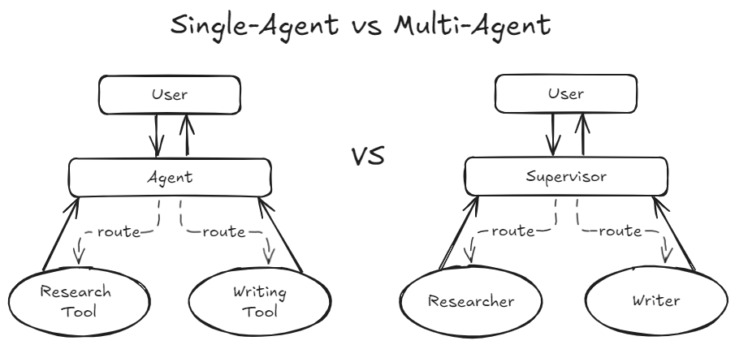

# GenAI Sandbox

Welcome to **GenAI Sandbox**! This repository is dedicated to my personal experiments and investigations in Generative AI (GenAI) and Natural Language Processing (NLP). Here, you'll find explorations, comparisons, and experiments related to different aspects of these technologies, with an open invitation to the community to engage, learn, and contribute.

## Table of Contents

- [Experiments and Investigations](#experiments-and-investigations)
  - [Comparison Between Single-Agent and Multi-Agent Approaches](#lab-1)
- [Getting Started](#getting-started)
- [Contributing](#contributing)
- [License](#license)

<a name="labs"/></a>
## Experiments and Investigations
[Back to ToC](#toc)

Below is a list of the experiments and investigations included in this repository:

<a name="lab-1"/></a>
### 1. [Comparison Between Single-Agent and Multi-Agent Approaches](./single_vs_multi_agent)

This investigation aims to compare the effectiveness of single-agent versus multi-agent approaches for building an Article Writer app. It includes two notebooks that demonstrate each approach:
- Single-Agent Approach: Implemented using LangChain with a Research Tool and a Writing Tool, both utilizing LLMs.
- Multi-Agent Approach: Implemented using CrewAI with two agent executors (Researcher and Writer) working collaboratively.

<p align="center">
  
</p>

<center>A visual comparison of single-agent and multi-agent approaches.</center>
<center>Image source: Author.</center>

The goal is to explore the capabilities, strengths, and limitations of each approach, and to determine whether a multi-agent system provides significant advantages over a single-agent setup.

<a name="getting-started"/></a>
## Getting Started
[Back to ToC](#toc)

To get started with the GenAI Sandbox, follow these steps:

1. **Clone the Repository**: Clone this repository to your local machine using:
   ```bash
   git clone https://github.com/yourusername/genai-sandbox.git
   ```

2. **Run Experiments**: Inside each experiment folder, you will find specific setup instructions, including the installation of necessary dependencies or configuration required to run that particular experiment. Follow those instructions to reproduce the results.

<a name="contributing"/></a>
## Contributing
[Back to ToC](#toc)

**GenAI Sandbox** is primarily a personal exploration project, but contributions are welcome! If you have ideas, feedback, or suggestions, feel free to open an issue or a pull request. Let's learn and innovate together!

<a name="license"/></a>
## License
[Back to ToC](#toc)

This repository is open-sourced under the [MIT License](LICENSE).
